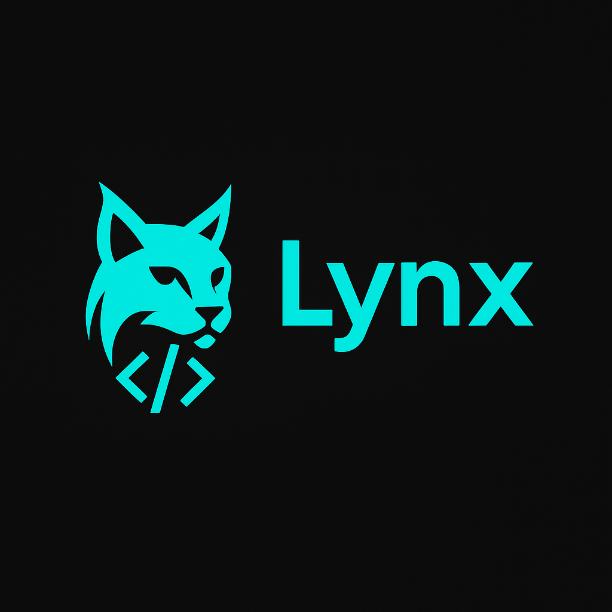

# Lynx Assistente VBA

  

## Visão Geral

Lynx é um assistente de IA especializado, projetado para ajudar profissionais a automatizarem suas tarefas diárias utilizando VBA (Visual Basic for Applications). Ele funciona como seu parceiro de programação pessoal para automação do Microsoft Office, com foco no Excel, mas estendendo-se a outros aplicativos do pacote Office.

## Propósito

Em ambientes corporativos, profissionais frequentemente precisam automatizar tarefas repetitivas, mas podem não possuir a experiência em programação ou o tempo necessário para escrever códigos VBA eficientes. O Lynx preenche esta lacuna fornecendo soluções VBA instantâneas e de alta qualidade, adaptadas às necessidades específicas de cada negócio.

## Principais Recursos

### 🤖 Geração de Código
Gere código VBA personalizado a partir de descrições em linguagem natural. Simplesmente explique o que você precisa, e o Lynx criará um código completo e funcional com tratamento de erros adequado e documentação.

### 🔍 Manutenção de Código
Faça upload de macros existentes para análise e aprimoramento. O Lynx irá:
- Identificar e corrigir bugs
- Otimizar gargalos de desempenho
- Melhorar a legibilidade do código
- Adicionar comentários abrangentes para melhor manutenção
- Sugerir melhorias arquiteturais

### 🔄 Integração com SAP
Especializado em integração SAP-Excel, o Lynx pode converter scripts SAP para código VBA otimizado, automatizando transferências complexas de dados entre SAP e Excel.

## Como Funciona

1. **Selecione o Tipo de Tarefa**
   - Gerar novo código VBA
   - Manter macros existentes
   - Criar integração SAP-Excel

2. **Forneça Contexto**
   - Descreva o que você precisa em linguagem simples
   - Faça upload de código existente para manutenção
   - Compartilhe scripts SAP para conversão

3. **Receba Soluções**
   - Obtenha código VBA completo e pronto para uso
   - Receba explicações detalhadas junto com o código
   - Instruções de implementação incluídas

## Benefícios para Empresas

### ⏱️ Eficiência de Tempo
Automatize horas de trabalho manual com soluções VBA personalizadas, liberando tempo valioso dos funcionários para tarefas de nível superior.

### 💰 Redução de Custos
Reduza a necessidade de desenvolvedores VBA especializados enquanto capacita a equipe existente para criar soluções de automação.

### 🚀 Aumento de Produtividade
Amplie as capacidades de processamento de dados sem aumentar o quadro de funcionários, lidando com conjuntos de dados maiores com precisão consistente.

### 📊 Redução de Erros
Elimine erros humanos em tarefas repetitivas através de automação confiável, especialmente crítico para operações financeiras e relatórios.

## Casos de Uso Comuns

- **Processamento de Dados**: Crie macros que formatam, limpam e transformam grandes conjuntos de dados
- **Automação de Relatórios**: Gere relatórios automaticamente em horários programados
- **Criação de Formulários**: Projete e implemente formulários interativos no Excel
- **Fluxo de Trabalho entre Aplicativos**: Conecte o Excel com Outlook, Word e outros aplicativos do Office
- **Interações com Bancos de Dados**: Crie código VBA para interagir com bancos de dados SQL
- **Integração com APIs**: Conecte o Excel a serviços web e APIs externas
- **Automação SAP**: Simplifique a troca de dados entre SAP e Excel

## Detalhes Técnicos

Lynx é construído sobre um modelo de linguagem de última geração, especificamente ajustado para programação VBA, com:

- Conhecimento das melhores práticas de programação VBA
- Familiaridade com os Modelos de Objeto do Office
- Compreensão dos requisitos de fluxo de trabalho de dados corporativos
- Experiência em scripts SAP

## Primeiros Passos

1. Acesse a interface do Lynx através do seu navegador web Link:https://lynx-automate.vercel.app/
2. Selecione o tipo de assistência que você precisa
3. Forneça contexto para seus requisitos específicos
4. Implemente o código gerado em seu ambiente Excel

## Segurança e Privacidade

- Nenhum código é armazenado permanentemente em nossos servidores
- Toda geração de código acontece em ambientes isolados
- Sua lógica de negócios e processos proprietários permanecem confidenciais
- Os dados são criptografados em trânsito e durante o processamento

## Suporte

Para assistência adicional ou dúvidas sobre a implementação do código gerado pelo Lynx em seu ambiente, entre em contato com o suporte pelo e-mail suporte@lynx-vba.com.

---

© 2025 Lynx Assistente VBA | Todos os Direitos Reservados
